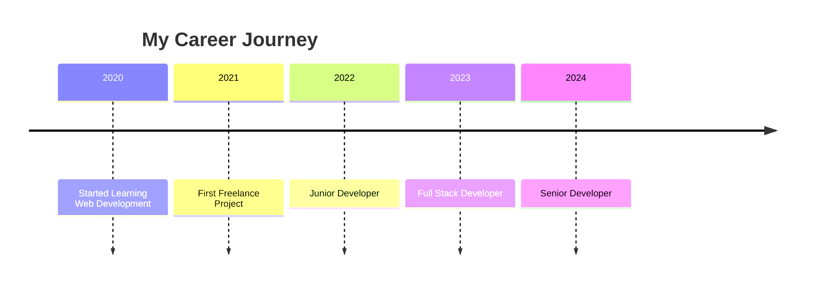

# 🎨 Customization Ideas for Your GitHub Profile

## Quick Customizations You Can Make

### 1. 🎭 Change the Typing Animation Text

**Current:**
```markdown
lines=Hey+There!+I'm+Ulwan+%F0%9F%91%8B;Welcome+to+my+GitHub+Profile!
```

**Ideas:**
```markdown
# Professional
lines=Full+Stack+Developer;Open+Source+Enthusiast;Always+Learning

# Fun
lines=Code+Wizard+%E2%9C%A8;Bug+Hunter+%F0%9F%90%9B;Coffee+Lover+%E2%98%95

# Skill-focused
lines=JavaScript+Developer;React+%7C+Node.js+%7C+PHP;Building+Cool+Stuff

# Multilingual
lines=Hello+%F0%9F%91%8B;Hola+%F0%9F%91%8B;Bonjour+%F0%9F%91%8B;こんにちは+%F0%9F%91%8B
```

### 2. 🎨 Change Color Themes

**Available Themes for GitHub Stats:**

```markdown
# Dark Themes
theme=dark
theme=radical
theme=merko
theme=gruvbox
theme=tokyonight (current)
theme=onedark
theme=cobalt
theme=synthwave
theme=highcontrast
theme=dracula

# Light Themes
theme=default
theme=solarized-light
theme=vue
theme=buefy
```

**How to Change:**
Replace `theme=tokyonight` in README.md with your choice.

### 3. 🛠️ Add More Tech Badges

**Languages:**
```markdown


```

**Frameworks:**
```markdown


```

**Databases:**
```markdown


```

**Cloud & DevOps:**
```markdown


```

### 4. 📊 Add More Stats Widgets

**GitHub Trophies:**
```markdown
## 🏆 GitHub Trophies

<div align="center">
  
</div>
```

**Activity Graph:**
```markdown
## 📈 Activity Graph

<div align="center">
  
</div>
```

**Contribution Calendar:**
```markdown
## 📅 Contribution Calendar

<div align="center">
  
</div>
```

### 5. 🎵 Add Spotify Now Playing

```markdown
## 🎵 Currently Listening To

<div align="center">
  
</div>
```

### 6. 📝 Add Blog Posts Section

```markdown
## 📝 Latest Blog Posts

<!-- BLOG-POST-LIST:START -->
<!-- BLOG-POST-LIST:END -->
```

Then add a GitHub Action to auto-update from your blog RSS feed.

### 7. 🎯 Add Skills Progress Bars

```markdown
## 💪 Skills

```text
JavaScript   ████████████████████░   95%
React        ███████████████████░░   90%
Node.js      ██████████████████░░░   85%
Python       ████████████████░░░░░   80%
PHP          ███████████████░░░░░░   75%
```
```

### 8. 🌟 Add Featured Projects

```markdown
## 🚀 Featured Projects

<div align="center">

[](https://github.com/matulwan/project-name)
[](https://github.com/matulwan/another-project)

</div>
```

### 9. 📱 Add More Social Badges

```markdown
[](https://discord.gg/your-invite)
[](https://instagram.com/your-handle)
[](https://youtube.com/@your-channel)
[](https://medium.com/@your-handle)
[](https://dev.to/your-username)
```

### 10. 🎨 Custom Profile Views Badge

```markdown
# Different Styles


# Different Colors


```

### 11. 🔥 Add GitHub Streak with Different Themes

```markdown
# Fire Theme


# Ocean Theme


# Neon Theme

```

### 12. 💼 Add Work Experience Timeline

```markdown
## 💼 Work Experience


```

### 13. 🎓 Add Certifications

```markdown
## 🎓 Certifications

- 🏅 **AWS Certified Developer** - Amazon Web Services
- 🏅 **React Developer Certification** - Meta
- 🏅 **Node.js Certification** - OpenJS Foundation
- 🏅 **MongoDB Certified Developer** - MongoDB University
```

### 14. 🌍 Add Visitor Map

```markdown
## 🌍 Visitor Map

<div align="center">
  
</div>
```

### 15. 🎯 Add Current Focus Section

```markdown
## 🎯 Current Focus

```diff
+ 🔭 Working on: Building a full-stack e-commerce platform
+ 🌱 Learning: TypeScript, GraphQL, Docker
+ 👯 Looking to collaborate on: Open source projects
+ 💬 Ask me about: React, Node.js, Web Development
+ 📫 Reach me: your.email@example.com
```
```

### 16. 🎮 Add Fun Facts Section

```markdown
## ⚡ Fun Facts

<details>
<summary>Click to expand!</summary>

- 🎮 Gamer in free time
- ☕ Coffee enthusiast
- 📚 Love reading tech blogs
- 🎵 Music while coding
- 🌙 Night owl developer

</details>
```

### 17. 📊 Add Wakatime Stats

```markdown
## ⏱️ Coding Time This Week

<div align="center">
  
</div>
```

### 18. 🎨 Add Custom ASCII Art

```markdown
<pre>
  ____  _ _   _   _       _     
 / ___|| | | | | | | __ _| |__  
| |  _ | | | | | | |/ _` | '_ \ 
| |_| || | | | |_| | (_| | | | |
 \____||_|_|  \___/ \__,_|_| |_|
                                
</pre>
```

### 19. 🔗 Add Quick Links Section

```markdown
## 🔗 Quick Links

<div align="center">

| 📚 [Documentation](link) | 🎨 [Portfolio](link) | 📧 [Contact](link) | 💼 [Resume](link) |
|:---:|:---:|:---:|:---:|

</div>
```

### 20. 🎪 Add Jokes/Memes

```markdown
## 😄 Random Dev Joke

<div align="center">
  
</div>
```

## 🎨 Layout Variations

### Compact Layout
```markdown
<div align="center">
  
  
</div>
```

### Side-by-Side Layout
```markdown
<table>
<tr>
  <td></td>
  <td></td>
</tr>
</table>
```

### Three Column Layout
```markdown
<div align="center">
  
  
  
</div>
```

## 💡 Pro Tips

1. **Don't Overdo It**: Keep it clean and readable
2. **Test on Mobile**: Ensure it looks good on all devices
3. **Update Regularly**: Keep information current
4. **Use Consistent Theme**: Stick to one color scheme
5. **Optimize Images**: Keep file sizes reasonable
6. **Check Links**: Ensure all links work
7. **Be Authentic**: Showcase real skills and projects

## 🎯 Next Level Ideas

- Add interactive elements with HTML/CSS
- Create custom SVG animations
- Build a personal API for dynamic content
- Add GitHub Actions for auto-updates
- Create themed sections for different seasons
- Add language switcher for international audience

---

**Mix and match these ideas to create your unique profile! 🚀**
